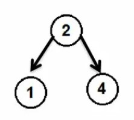
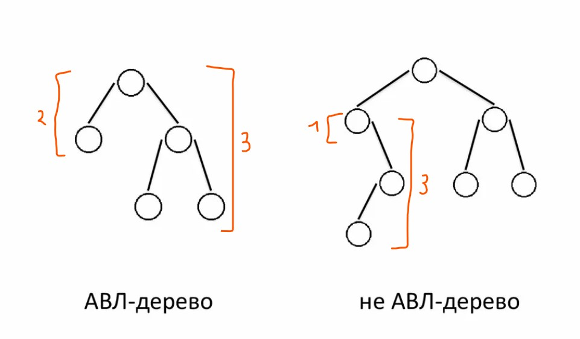
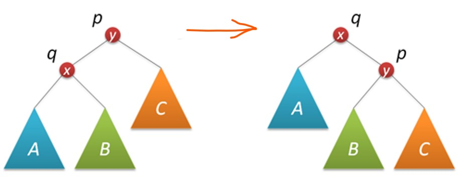
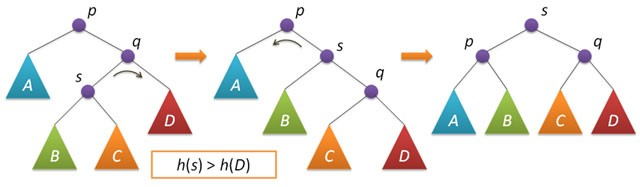

# Алгоритм вставки элемента в АВЛ-дерево. Длинный и короткий повороты.

Содержание:

1. АВЛ дерево – это
1. Вставка элемента
1. Малые повороты – левый и правый
1. Большие повороты – левый и правый
____

## 1. АВЛ дерево

Это двоичное дерево поиска, левая вершина (ребёнок) которого меньше родителя, а правая вершина (ребёнок) больше. 

<p align="left">

</p>

Поиск нужного элемента производится как в обычном двоичном дереве, главным отличием является алгоритм добавления новой вершины: для любого узла дерева высота его правого поддерева отличается от высоты левого поддерева не более чем на единицу.

<p align="center">

</p>

Структура узла:
```c++
struct AVLTree {
  int val;
  int height;
  AVLTree* left;
  AVLTree* right;
};
```
____
## 2. Вставка элемента

Добавление элемента происходит как в двоичном дереве.

Первый случай: дерево изначально пустое – новый блок стал корнем.

Второй: ищем место куда добавить элемент – спускаемся вниз по дереву, пока не найдем нужное место (справа от узла - если значение переменной больше, слева - если меньше). Нашли – закрепили. 

В лабораторной реализовывал с помощью рекурсии.

А вот тут и начинаются различия от обычного дерева: добавив новый элемент может случиться так, что высота слева и справа будет отличаться больше чем на 1. Нужно делать балансировку для каждого поддерева, выходя вверх из рекурсии. Важно также не забываем обновлять высоту 
```c++
AVLTree* AppentToTree(AVLTree* BlockNow, int val) {
              . . .    //поиск места куда добавить + рекурсия 
    BlockNow = MakeATurn(BlockNow);
    BlockNow->height = MaxHeight(BlockNow) + 1;
    return BlockNow;
}
```

## 3. Малые повороты 
____

Рассмотрим ситуацию для правого малого поворота: 

<p align="center">

</p>

Псевдокод:
```c++
AVLTree* RightSmallTurn(AVLTree* p) { // правый поворот вокруг p
      AVLTree* q = p->left;
      p->left = q->right;
      q->right = p;
  
      //также надо изменить высоту у узла p и q
      return q;
}
```
Левый поворот реализуется аналогично.

## 4. Большие повороты
____

Реализуются на основе двух маленьких поворотов. Какой именно надо делать зависит от того, какие в данный момент высоты у поддеревьев ниже. Описывать словами все варианты не думаю хорошей идеей, ниже рассмотрены все случаи:
```c++
if (CheckNULL(BlockNow->right) - CheckNULL(BlockNow->left) > 1 ) {
    if (CheckCheckNULL(BlockNow->right, 1)  <= CheckCheckNULL(BlockNow->right, 0)) {
        BlockNow = LeftSmallTurn(BlockNow);
    } else {
        BlockNow = LeftBigTurn(BlockNow);
    }
} else {
    if (CheckCheckNULL(BlockNow->left, 0) <= CheckCheckNULL(BlockNow->left, 1)) {
        BlockNow = RightSmallTurn(BlockNow);
    } else {
        BlockNow = RightBigTurn(BlockNow);
    }
}
```
На примере большого левого:

<p align="center">

</p>

А вот и весь код поворота:
```c++
AVLTree* LeftBigTurn(AVLTree* Block) {
    Block->right = RightSmallTurn(Block->right);
    Block = LeftSmallTurn(Block);
    return Block;
}
```

Большой левый делается аналогично.
____

По традиции, мем: 
<p align="center">

</p>
