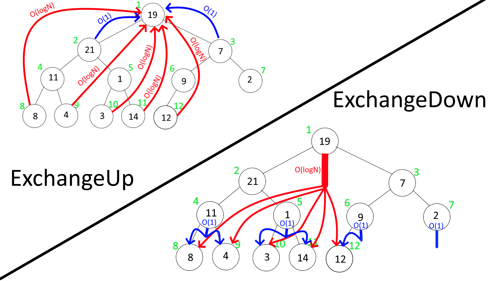

# Алгоритм пирамидальной сортировки

<p align="center">

</p>

## Общая информация

HeapSort – метод сортировки массивов, предложенный Дж. Уильямсом в 1964 году. 
<p align="center">

</p>

## Основная суть алгоритма
```
1. Построение дерева из исходных данных;

While (В дереве больше одного элемента) {

2.  Сортировка дерева;
3.  Меняем местами первый и последний элемент;
4.  Теперь первый элемент, который стал последним мы больше не трогаем и удаляем из нашего дерева;

}                                               
return 0;   //  😋
```
Давайте перейдём к более наглядному описанию алгоритма:
1)	Из данного массива образуется дерево такого вида, но само дерево мы всё так же будем хранить в виде массива, где дети вершины под номером **index** хранятся под номерами **index * 2** и **index * 2 + 1** (если индексация начинается с **1**).
<p align="center">

</p>
 
2)	Далее нам нужно отсортировать кучу, чтобы каждый родитель был больше (или равен) его детей, то есть чтобы
```c
Array[index] >= Array[index*2] and Array[index] >= Array[index*2+1]
```
Реализуем функцию, которая будет находить наибольшего из детей данного родителя, и сравнивать с ним. Если наибольший из детей оказался больше родителя, то меняем их местами, и рекурсивно вызываем эту же функцию для детей, чтобы отсортировать ниже изменившуюся часть. В случае если наибольший из детей оказался меньше родителя, то ничего не делаем.       

Пример кода:
  ```c
  void ExchangeDown(int* iArray, int lenArray, int index) {
    if ((index * 2) < lenArray) {
      int max = index * 2;
      if ((max + 1) < lenArray && iArray[max] < iArray[max + 1]) {
        ++max;
      }
      if (iArray[max] > iArray[index]) {
        swap(iArray[index], iArray[max]);
        ExchangeDown(iArray, lenArray, max);
      }
    }
  }
  ```
И необходимо запустить этот функцию для каждой из вершин начиная с последней, таким образом мы полностью преобразуем наше дерево (массив) в необходимый нам вид.              
## Почему нужно начинать с последней вершины?
Давайте рассмотрим на конкретном примере, начав с первой вершины (возьмём немного изменённое дерево, для наглядности)
<p align="center">

</p>
Первая операция ничего не изменит т.к. 19 > 1 и 19 > 7, далее переходим на вторую вершину, здесь 21 > 11 => наибольший из детей равен 21 и он больше 1, поэтому меняем их местами.    
</p>
<p align="center">

</p>
Нужно заметить, что подъём вершины осуществляется только за счёт выполнения ExchangeDown от родителя. То есть теперь, чтобы 21 поднять ещё выше необходимо запустить ExchangeDown от первой веришины, а эта команда уже была выполнена, и мы никогда туда больше не вернёмся. Из чего можно сделать вывод, что последняя операция, которая должна быть выполнена в преобразовании дерева это ExchangeDown от первой вершины, именно она поднимает максимальное число в корень дерева.

## Почему мы используем спуск вниз, а не подъём вверх?
Функция ExchangeDown осуществляет рекурсивный спуск, а ExchangeUp рекурсивный подъём. По сути, сложность обоих функций O(logN), так почему же мы отдаём предпочтение ExchangeDown?
Оба алгоритма нужно будет прогнать по всем элементам (т.е. N раз). Вся суть в том, что для ExchangeDown logN операций может быть выполнено только для корня дерева, в то время как для листьев выполнится только 1 операция. У ExchangeUp - наоборот: logN операций выполняется для всех листьев, а для корня - только 1.
Поскольку листьев всегда больше, чем корней (🤷), вариант с ExchangeDown будет работать быстрее.
<p align="center">

</p>

## Вернёмся к выполнению алгоритма
Вот то, что у нас получится после выполнения программы:

<p align="center">

</p>
 
3)	Меняем местами первый и последний элемент;
 
<p align="center">

</p>
 
4)	Теперь первый элемент, который стал последним мы больше не трогаем и удаляем из нашего дерева (уменьшаем количество элементов в массиве на один)
```c
 --lenArray;
```
<p align="center">

</p>

2) Следующее необходимое действие, это отсортировать массив, но в этот раз нам не нужно применять функцию **ExchangeDown** к каждому элементу, необходимо запустить её от первого элемента и дерево окажется вновь отсортированным.

Дерево после выполнения:
```c
ExchangeDown(Array, lenArray, 1);
```
<p align="center">

</p>

И так далее, процесс должен продолжаться пока в дереве не останется одно число, это число окажется наименьшим среди всех и уже будет стоять на нужном месте (первое в списке), всё наш массив оказался полностью отсортирован, поздравляю!!! 🎉 🎉 🎉

Мы большие молодцы)))

[](https://www.youtube.com/watch?v=hQYhdHjP-gM)
