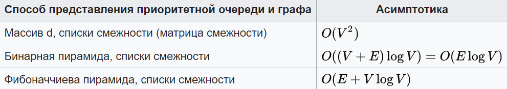
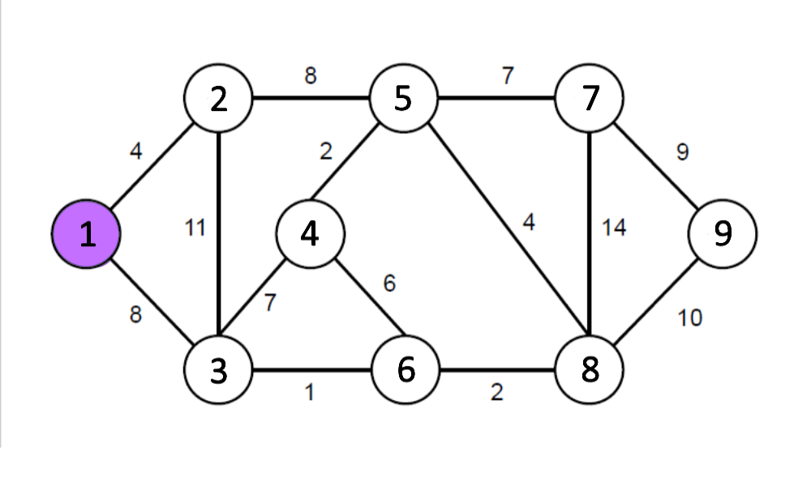
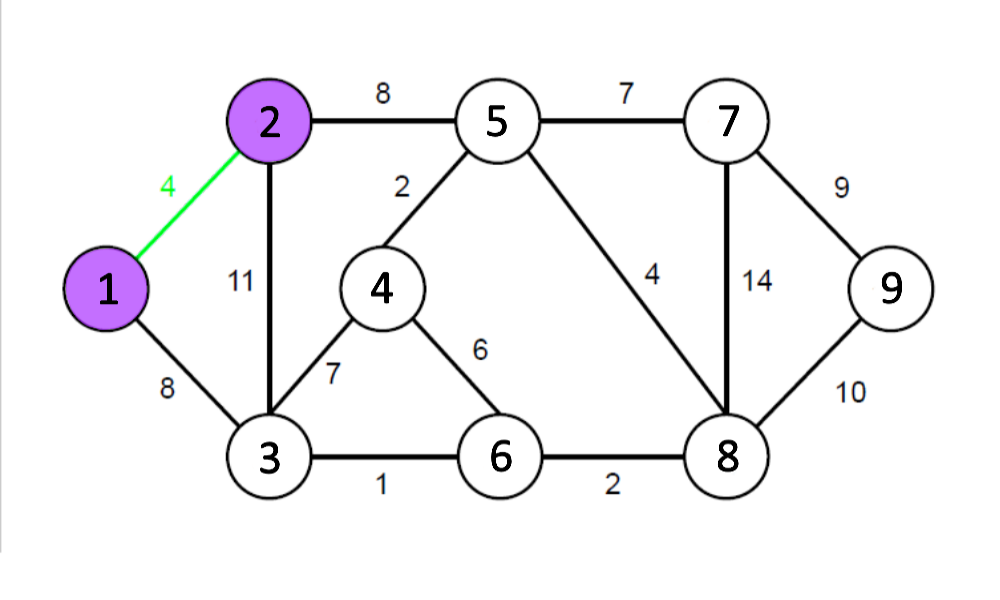
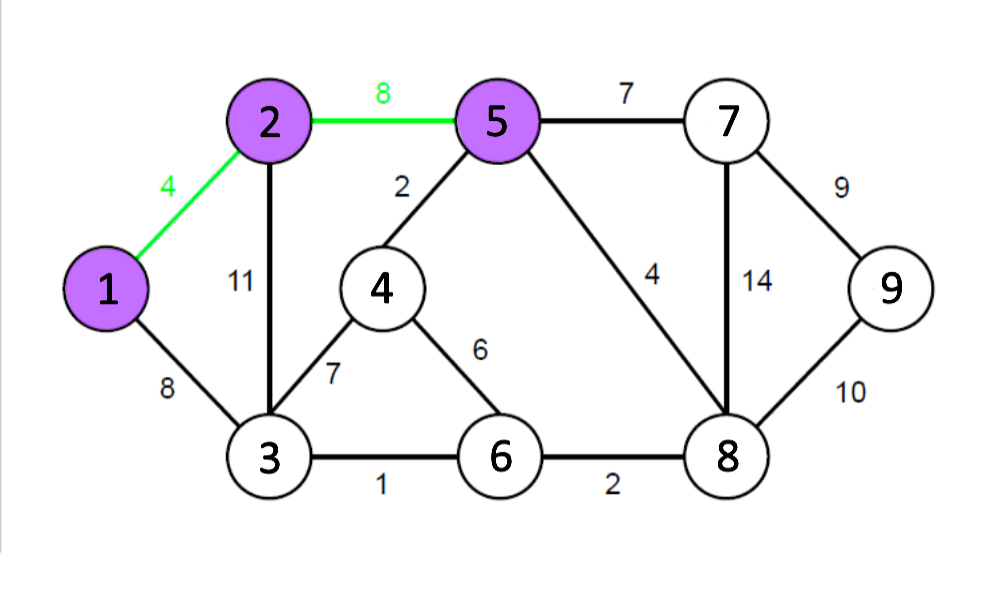
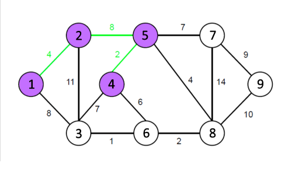
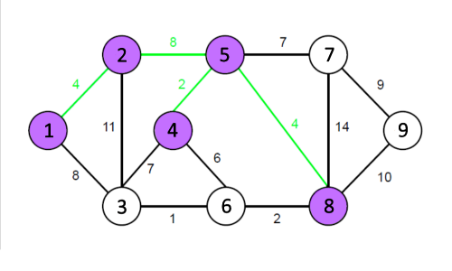
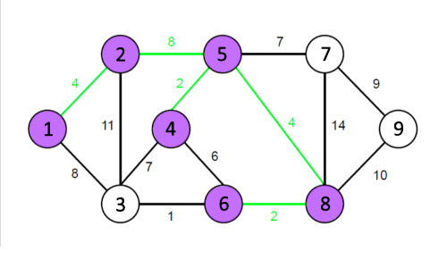
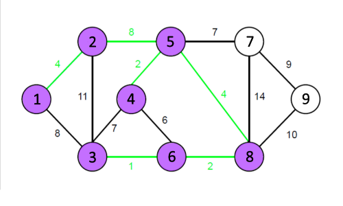
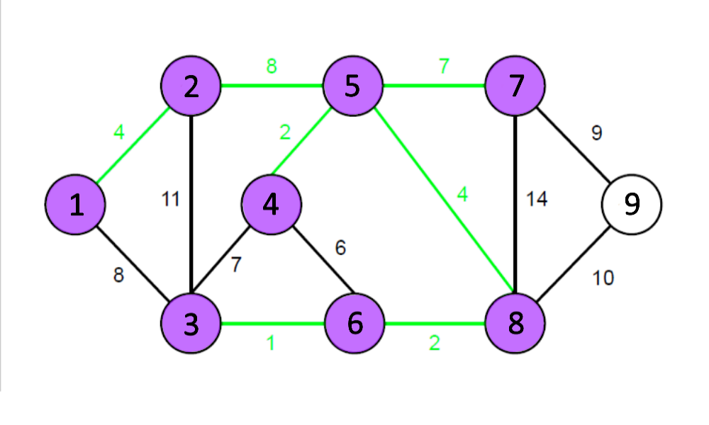

# Общая инфа

**Алгоритм Прима** — алгоритм построения минимального остовного дерева взвешенного связного неориентированного графа. Алгоритм впервые был открыт в 1930 году чешским математиком [Войцехом Ярником](https://ru.wikipedia.org/wiki/%D0%AF%D1%80%D0%BD%D0%B8%D0%BA,_%D0%92%D0%BE%D0%B9%D1%82%D0%B5%D1%85 "Ярник, Войтех"), позже переоткрыт [Робертом Примом](https://ru.wikipedia.org/w/index.php?title=%D0%9F%D1%80%D0%B8%D0%BC,_%D0%A0%D0%BE%D0%B1%D0%B5%D1%80%D1%82&action=edit&redlink=1 "Прим, Роберт (страница отсутствует)") в 1957 году, и, независимо от них, [Э. Дейкстрой](https://ru.wikipedia.org/wiki/%D0%94%D0%B5%D0%B9%D0%BA%D1%81%D1%82%D1%80%D0%B0,_%D0%AD%D0%B4%D1%81%D0%B3%D0%B5%D1%80_%D0%92%D0%B8%D0%B1%D0%B5 "Дейкстра, Эдсгер Вибе") в 1959 году.

Оценка
Асимптотика алгоритма зависит от способа хранения графа и способа хранения вершин, не входящих в дерево. Если приоритетная очередь *Q* реализована как обычный массив *d*, то *Extract.Min(Q)* выполняется за *O(n)*, а стоимость операции *d[u] ← w(v,u)* составляет *O(1)*. Если *Q* представляет собой [бинарную пирамиду](https://ru.wikipedia.org/wiki/Двоичная_куча), то стоимость *Extract.Min(Q)* снижается до *O(log n)*, а стоимость *d[u] ← w(v,u)* возрастает до *O(log n)*. При использовании [фибоначчиевых пирамид](https://ru.wikipedia.org/wiki/Фибоначчиева_куча) операция *Extract.Min(Q)* выполняется за *O(log n)*, а *d[u] ← w(v,u)* за *O(1)*.

# Остовное дерево, шо це таке?

О́стовное де́рево графа (англ. Spanning tree) — это дерево, подграф данного графа, с тем же числом вершин, что и у исходного графа. Оно получается из исходного графа путём удаления максимального числа рёбер, входящих в циклы, но без нарушения связности графа. Остовное дерево включает в себя все **n** вершин исходного графа и содержит **n-1** ребро.

# Суть алгоритма

Сама суть алгоритма невероятно проста. Изначально нам нужно взять рандомную вершину, с которой мы начнём, я люблю циферку 1, так что мы начнём с первой вершины))

Теперь нам необходимо выбрать ребро, содержащее 1 и имеющее наименьшую стоимость. В нашем случае это будет ребро 1<-->2 (4)

А теперь ищем ребро, содержащее уже пройденную вершину (фиолетовые, 1 и 2) минимальной стоимости. У нас оказалось таких два: 2<-->5 (8)  и  1<-->3 (8). Выбираете какое вашей душе угодно, вообще космически 🌌                                                                        
Я выберу 2<-->5 (8), получим:

А вот теперь ищем минимальное среди рёбер, содержащих вершины 1, 2 или 5. И продолжаем в том же духе, пока не будут задействуемы все вершины (или пока не будет использовано **N – 1** ребро).  

**Важное замечание!!!** Не нужно брать ребро, содержащее две помеченные вершины, оно не продвинет нас вперёд, лишь увеличит стоимость нашего дерева

<align="right">

<align="right">

<align="right">

Всё, все вершины были пройдены, использовано **N – 1** ребро, работа алгоритма подошла к концу. Мы получили необходимое нам остовное дерево. Оказалось не так уж и сложно)                                                          
Удачной всем проги, всем peace [✌](https://www.youtube.com/watch?v=dQw4w9WgXcQ)
