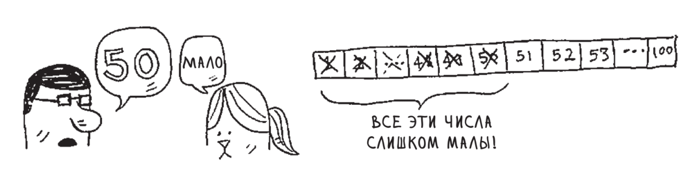

# Алгоритмы поиска в массиве: линейный поиск, бинарный поиск, оценки сложности


<p align="center">

</p>


## Линейный поиск

  Идея последовательного поиска очевидна. Она состоит в том, чтобы,
начав просмотр с первого элемента массива, продвигаться дальше
до тех пор, пока не будет найде нужный элемент или пока не будут
просмотрены все элементы массива.<br/>

<p align="center">

</p>

  Время работы алгоритма зависит от количества сравнений ключей: в
худшем случае алгоритм последовательного поиска делает полный проход
по всем элементам массива, поэтому время работы алгоритма линейно 
по *N* - количеству элементов в массиве.

Реализация на Си:
```C
int SearchLinear(int key, int* array, int N) {
	for (int i = 0; i < N; ++i){
		if (array[i] == key){
			return 1; // Элемент найден
		}
	}
	return 0; //Элемент не найден
}
```
Если взять ```key = J```, а в ```array``` закинуть английский алфавит, то графическое описание будет выглядеть как-то так:

<p align="center">

</p>

Сложность в худшем случае: ___O(n)___

## Бинарный поиск

Бинарный поиск также называют *дихотомия*. 
Это простой и эффективный алгоритм поиска для элементов, у которых существует понятие порядка.<br/>
Поиск работает на __упорядоченном массиве__. 
Поэтому для него необходимо либо сначала *упорядочить данные*, либо использовать его на структуре, которая сама обеспечивает упорядоченность (например, бинарное дерево или куча).

Искомое значение сравнивается с элементом посередине. 
Если он больше, мы знаем, что данные упорядочены по возрастанию, а значит все значения справа от него тоже больше. 
Таким образом мы отбрасываем половину массива правее этого элемента, и продолжаем с остатками.

<p align="center">

</p>


Кроме точного поиска, этот алгоритм позволяет найти ближайший к искомому. Им будет последний оставшийся элемент.

Бинарный поиск разбивает интервалы на 2 половины, пока не дойдет до двух полуинтервалов, где у каждого размер 1. 
В конечном счете n элементов разделены на два элемента, в двух под-интервалах, двух интервалов, и т.д. 
То есть всё n бьется на произведение двоек. 
Значит количество таких операций разделения – это то, сколько двоек нужно перемножить, чтобы получить n. 
А это по определению двоичный логарифм, значит сложность алгоритма по времени – ___O(log n)___.
```C
int SeekBinary(int key, int* array, int N){
	int left = 0;
	int right = N - 1;
	int middle;
	do{
		middle = (left + right) / 2;
		if (key == array[middle]) {
			return 1; //Элемент найден
		} else if (array[middle] < key){
			left = middle + 1;
		} else {
			right = middle - 1;
		}
	} while(left <= right);
	return 0; //Элемент не найден
}
```
Вот, собственно и всё :)

```#МемыЭтоКруто```
<p align="center">

</p>
