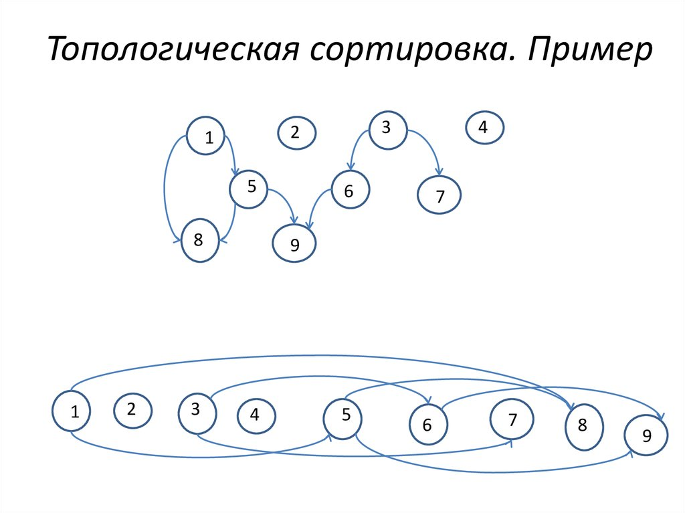

# Топологическая сортировка

## TL;DR
**Топологическая сортировка** - алгоритм сортировки вершин ориентированного графа,
создающий такой линейный порядок вершин, что родительский узел всегда
больше (левее) дочернего.

Сложность: `O(V + E)`, где `V` - количество вершин в графе, а `E` - количество ребер.

* Только ациклический граф подлежит топологической сортировки.

Доказательство: упражение

## Описание алгоритма

0. Проверить граф на наличие циклов. Можно, например, использовать DFS

1. Идем по списку вершин. Если вершина не проверена - выполняется следующий алгоритм:
- Вершина отмечается как посещенная
- Проверить, что у вершины нет непосещенных дочерних вершин.
  Если есть, то для каждой рекурсивно выполнить алгоритм из пункта `1.`
- Добавить вершину в стек

2. Вывести стек

## Нейробред

  
Эта статья по версии ChatGPT (Осуждаю)

Топологическая сортировка - это алгоритм сортировки ориентированного ациклического графа (DAG),
который упорядочивает вершины таким образом, чтобы каждое ребро в графе указывало на вершину, стоящую впереди в упорядоченном списке.

Алгоритм топологической сортировки состоит из следующих шагов:

1. Найти вершины, не имеющие входящих ребер (то есть вершины, которые не зависят от других вершин).

2. Поместить найденные вершины в список упорядоченных вершин.

3. Удалить найденные вершины из графа вместе со всеми исходящими ребрами.

4. Повторять шаги 1-3 до тех пор, пока не останется ни одной вершины в графе.

Если в графе остались вершины, которые имеют входящие ребра, то это означает, что граф содержит циклы, и топологическая сортировка невозможна.

Алгоритм топологической сортировки можно реализовать с помощью стека или очереди. В каждой итерации алгоритма мы добавляем в список упорядоченных вершин вершину, которая не имеет входящих ребер, и удаляем ее из графа вместе со всеми исходящими ребрами. Это означает, что мы можем использовать стек или очередь для хранения вершин без входящих ребер и удаления их из графа.

Алгоритм топологической сортировки имеет сложность O(V + E), где V - количество вершин в графе, а E - количество ребер.

