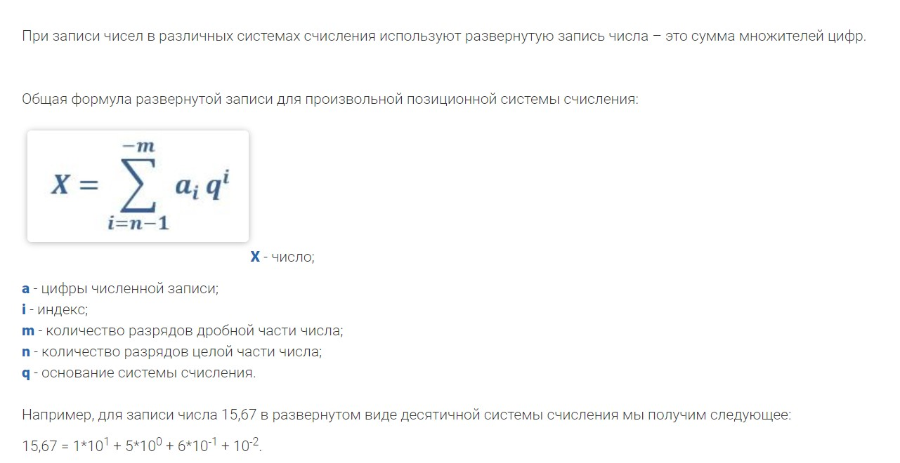

## Алгоритмы записи целых чисел в произвольной с.с.

Под позиционными системами счисления понимают такие системы, в которых одна и та же цифра может обозначать различные числа в зависимости от того места, на котором эта цифра стоит.

Основание – это количество знаков, которые используются в выбранной системе счисления.

Разряд – это место цифры в некотором числе, чем правее находится цифра в числе, тем меньший у нее разряд.

Если число необходимо записать в систему счисления с основанием большим за 10, то принято использовать буквы. Например, если некоторое число необходимо записать в развернутом виде в шестнадцатеричной системе счисления, то следует использовать следующие знаки: 0, 1, 2, 3, 4, 5, 6, 7, 8, 9, A, B, C, D, E, F.

