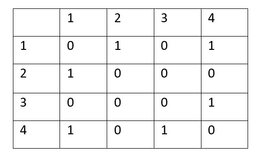
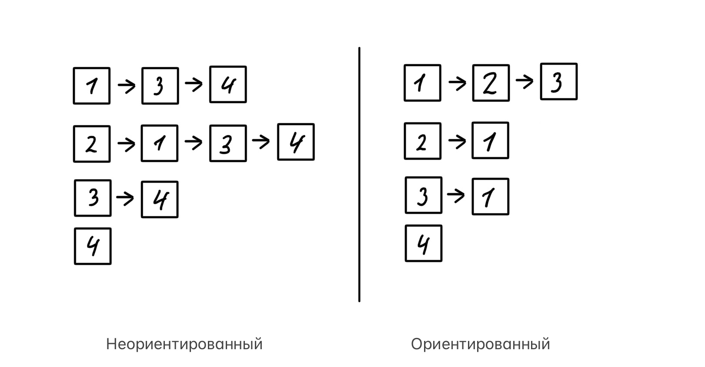
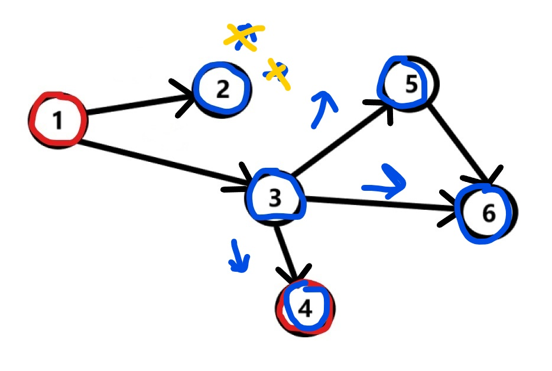

# Алгоритм обхода графа в глубину и в ширину

Содержание:

1. Что такое граф
1. Обход в глубину
1. Обход в ширину
1. Оценка сложности
____


## 1. Что такое граф

  Граф — это абстрактное представление множества объектов и связей между ними. Он состоит из множества вершин (V) и множества рёбер (E) и бывает ориентированный (каждое ребро имеет направление пути => перемещаться можно только в одну сторону, если нет обратного пути) и неориентированный (ребро соединяет две вершины, двигаться можно в обе стороны). 
  
<p align="left">

</p>

Представить граф можно в виде матрицы смежности:
<p align="left">

</p>

Первая верхняя строка и первый левый столбец – номера вершин, пересечения – наличие пути (1 если существует путь, 0 если нет). В случае если ребра имеют определенный вес – вместо 1    ставится вес. Опять же, представлен случай для неориентированного графа, где array[ I ][ j ] = array[ j ][ I ]. В ориентированном будет ставиться 1 только в одну ячейку согласно указанному пути из вершины. 

Или списков смежности:

<p align="left">

</p>
Теперь можно перейти к теме статьи.


## 2. Обход графа в глубину

Обход в глубину или DFS работает по принципу "идём по пути, пока не упремся в тупик". Если в результате мы достигли нужной вершины - победа. Иначе, возращаемся на ближайшее разветвление и идём по другому маршруту.

Рассмотрим работу алгоритма на примере проверки возможности дойти из вершины "1" в "4" на таком ориентированном графе:
<p align="left">

</p>
Находясь в вершине 1, запускаем DFS. Исследуем возможный путь, двигаясь до конца, попутно проверяя, нашли ли мы нужную вершину:
<p align="left">

</p>
Достигнув конца пути, не встретили нужную вершину, возращаемся на развилку и идём по другому маршруту:
<p align="left">

</p>
Из "3" есть 3 пути, продолжаем:
<p align="left">

</p>
"6" - конечная вершины данного пути, но не искомая вершина. Возращаемся на ближайщее разветвление:
<p align="left">

</p>
Путь из "3" в "6" не рассматриваем, так как в вершине "6" мы уже побывали, а от туда нет пути до искомой вершины. Остается лишь один маршрут и о чудо, мы нашли то что искали)
<p align="left">

</p>

Реализация алгоритма основана на [рекурсии](https://youtu.be/ykl42cJVB9I?t=60)
```c++
int DFS(graf (сам граф), vertexNow (вершина на данный момент), finish (искомая вершина), int* result) {
    if (vertexNow == finish) {
        return 0;
    }
    if (vertexNow.visit == 1) {
        return 1;
    }
    ///  в этой части кода проверка соседей, в зависимости от реализации самого графа проходимся по всем соседним вершинам
        *result = DFS(graf, "vertex куда спустились", finish, result);
        if (*result == 0) {
            return 0;
        }
    /// и в случае, если добраться не удалось
    return 1;
}
```
Где return 0 означает, что мы нашли искомую вершину, 1 если не получилось.

## 3. Обход графа в ширину

Обход в ширину или BFS работает совершенно иначе: вместо того, чтобы идти по какому-то пути до тупика, он за 1 шаг посещает всех соседей вершины "1", за следующий шаг всех соседей соседей "1" и так до тех пор, пока не найдется искомая вершина. Рассмотрим на том же примере:
<p align="left">

</p>
Если в BFS вопросов куда пойти следующим действием не было, то как быть здесь? На помощь приходит очередь с идеей: первым вошёл, первым вышел. Добавим "2" и "3" вершину в нашу пока что пустую очередь: 

`| 2 | 3 |  |  |  |`


<p align="left">

</p>

<p align="left">

</p>

Если в BFS вопросов куда пойти следующим действием не было, то как быть здесь? На помощь приходит очередь с идеей: первым вошёл, первым вышел. 
