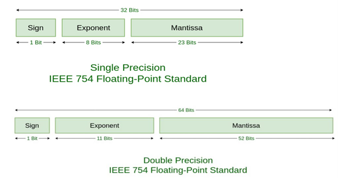
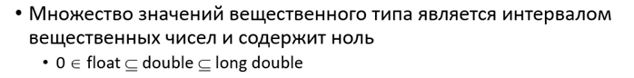

# Вещественные типы в языке Си
## Определение
Вещественные типы языка Си, или типы «с плавающей точкой», относятся к полным типам языка, то есть элементы множества значений имеют известный размер в байтах.
В соответствии с принципами архитектуры фон Неймана – Лебедева данные в памяти ЭВМ представлены в двоичном виде (то есть пока понятно, что вещественные числа в памяти представлены некоторым блоком байт с нулями и единицами).
Нетрудно догадаться, что в соответствии с рядом условностей (по-русски – договоренности о стандарте представления вещественных типов в памяти ЭВМ (IEEE 754 – «ай-ай-ай 754»)) часть битов хранит знак,
часть битов хранит экспоненту – степень основания СС – и мантиссу – множитель перед экспонентой.


->[Экспоненциальная запись числа](images/exponent.png "Экспоненциальная запись")<-


Собственно, стандарт предполагает следующее распределение обязанностей:
 
 
-><-


Данный стандарт обеспечивает следующие крутые свойства вещественной арифметики: 
- Результат арифметических операций всегда определен (но может отличаться от соответствующих арифметических операций в математике)
- Результат сравнения всегда определен


В стандарте С99 для вещественной арифметики предусмотрены типы float, double, long double, а также соответствующие комплексные значения – complex + float/double/long double.
Отношения множеств значений вещественных типов можно помотреть на картиночке:


-><-
 
 
На заметку – очевидно, что не для любого вещественного числа (мощность множества коих континуальное) есть соответствующее значение в одном из вещественных типов языка Си (мощность множества которых, очевидно, конечно).
Тогда чем меньше кусок вещественной прямой, с которым мы работаем, тем точнее представление значения в памяти. Поэтому для уменьшения ошибок (ошибки у работяг, а это погрешность (o_O)) при вещественных вычислениях лучше держать все значения в границах, например, соразмерных [-1;1] (Вспоминаем семинар с Михаилом из Huawei). 

##  Арифметические операции и преобразования типов.

Что рассказать про преобразования вещественных типов языка Си? Для начала – существует явное и неявное преобразование типов. Явное преобразование к типу Т производится с помощью операции (T). Неявное преобразование типов происходит “незаметно” для программиста – при вычислении значений арифметических операций над разными типами, при сравнении переменных разного типа и т.п.
Правила преобразования типов таковы:
-	Преобразование конечного числа с плавающей точкой в целое => округление к нулю
-	Если целая часть выходит за диапазон целого типа, то поведение не определено
-	Если целое представимо в типе с плавающей точкой точно, то значение сохраняется
-	Представление может измениться
-	Если целое попадает в диапазон типа с плавающей точкой, то ближайшее к нему меньшее или большее значение с плавающей точкой
-	Выбор зависит от реализации
-	Если целое не попадает в диапазон типа с плавающей точкой, то результат не определен
Для приведения вещественных типов между собой:
-	Преобразование к большему типу float --> double --> long double
-	Значение сохраняется
-	Представление может измениться
-	Преобразование к меньшему типу Т
-	Если значение представимо в Т точно, то оно сохраняется
-	Если значение попадает в диапазон Т, то выбирается ближайшее меньшее или большее значение Т
-	Зависит от реализации
-	Если не попадает в диапазон Т, то поведение не определено

## Плюшки с собесов. 
Есть отрезок для разбиения на некоторые подотрезки. Границы отрезков могут принимать вещественные значения. Условно – надо пробежаться по отрезку от 10.0 до 0.0 с шагом 0.2 и при значении границы == 2.0 остановиться, вернув значение.
Звучит просто. Примерный код джуна:
 
 
```c++
#include <stdio.h>
#include <stdlib.h>

int main(void) {
    double X = 10;
	double dx = 0.2;
	// printf("1.0 is %.20lf\n", 0.1 + 0.1 + 0.1 + 0.1 + 0.1 + 0.1 + 0.1 + 0.1 + 0.1 + 0.1);
	for (double x = X; x != 0; x -= dx) {
	    printf("%lf\n", x);
		if (x == 2.0) {
		    printf("Find Good value: \t%lf", x);
			return EXIT_SUCCESS;
		}
	}
	return EXIT_SUCCESS;
}
```
 
 
Закомментированная строка пока пусть хранит дальше свои секреты. По сути X – правая граница отрезка, dx – шаг движения по отрезку. В цикле for от правой большой границы по одному шагу размером dx двигаемся к 0.0.  Когда дойдем до x == 2.0 (должны же, че) выведем сообщение и выйдем из программы. 
Вывод программы:
```bash
-10724.800000
-10725.000000
-10725.200000
-10725.400000
-10725.600000
-10725.800000
-10726.000000
-10726.200000
$ ^C
```
 
Че? Откуда бесконечный цикл? Оттуда. Условие цикла for не выполняется. Почемяу?
Раскомментим ту магическую строку.
```bash
$ ./Stest.exe
1.0 is 0.999999999999999989000
10.000000
9.800000
9.600000
9.400000
9.200000
9.000000
8.800000
...
```
 
Хоба… Шо произошло … Десять раз сложили по сто грамм (0.1). Во всех нормальных странах получился килограмм, а в России – литр. Теперь серьезно. Уже говорили, что вещественная арифметика неточная. Отсюда и погрешность. Значит, нужно в коде условие цикла for заменить на x >= 0.
Смотрим:
 
```bash
$ ./Stest.exe
1.0 is 0.999999999999999989000
10.000000
9.800000
9.600000
9.400000
9.200000
....
2.800000
2.600000
2.400000
2.200000
2.000000
1.800000
1.600000
1.400000
1.200000
1.000000
0.800000
0.600000
0.400000
0.200000
0.000000
```

И где? Да всё там же – строгое равенство вещественных типов не выполняется (где-то там глубоко в каком-то знаке после запятой что-то не совпадает и всё). Поэтому условие if (x == 2.0) не выполняется.
Че делать? Думать в парадигме окрестностей (вместо жестких условий на равенство проверим принадлежность значения некоторой окрестности ожидаемого значения, меньшей шага):

```c++
#include <stdio.h>
#include <stdlib.h>
#include <math.h>

int main(void) {
    double X = 10;
	double dx = 0.2;
	printf("1.0 is %.20lf\n", 0.1 + 0.1 + 0.1 + 0.1 + 0.1 + 0.1 + 0.1 + 0.1 + 0.1 + 0.1);
	for (double x = X; x != 0; x -= dx) {
	    printf("%lf\n", x);
		if (fabs(x - 2.0) < dx / 2.0) {
		    printf("Find Good value: \t%lf", x);
			return EXIT_SUCCESS;
		}
	}
	return EXIT_SUCCESS;
}

```
 
Смотрим вывод:
```bash
$ ./Stest.exe
1.0 is 0.999999999999999989000
10.000000
9.800000
9.600000
9.400000
9.200000
....
2.800000
2.600000
2.400000
2.200000
2.000000
```
 
Вы прекрасны. Спасибо за внимание!
Читай внимательно, чтобы на экзамене не было вот так:
 

-> <-