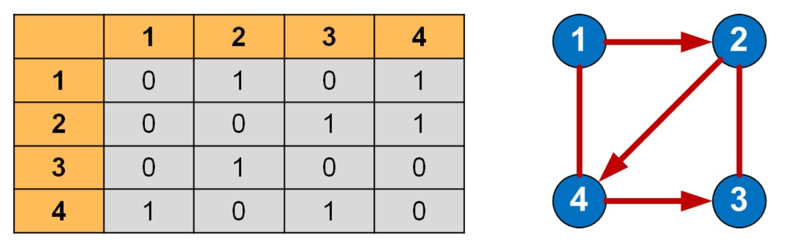
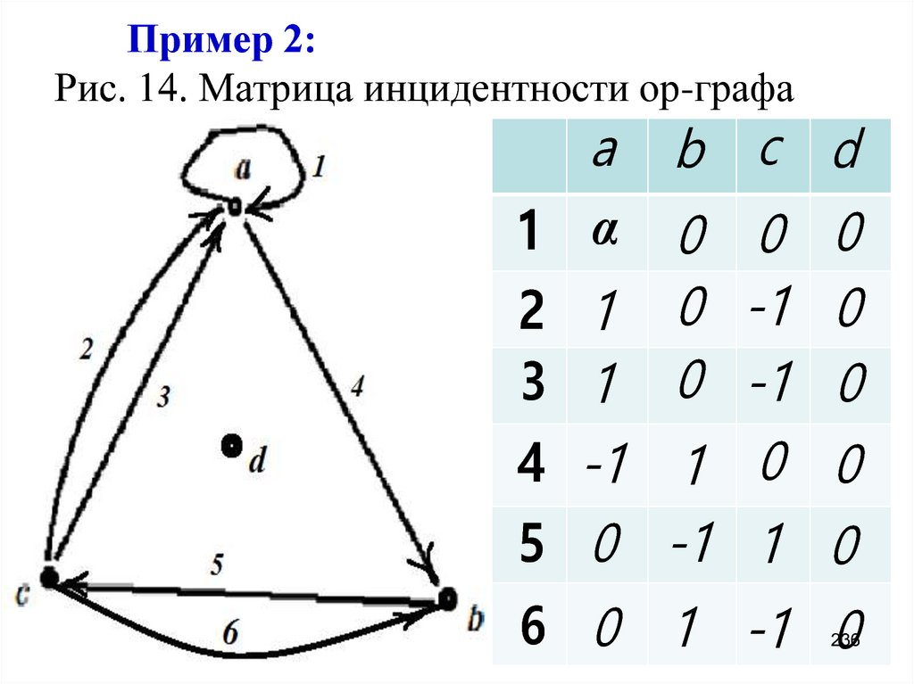
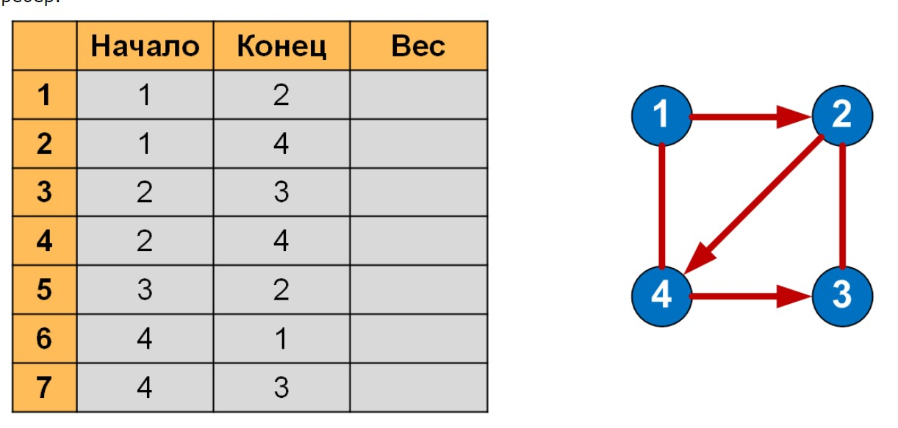

## Граф. Представление в ЭВМ: матрицы  смежности и инцидентности, список дуг

****
**Граф** - это совокупность двух множеств {V, E}, где V - множество вершин, а E - множество парных связей между вершинами.

Встречаются такие графы, ребрам которых поставлено в соответствие конкретное числовое значение, они называются *взвешенными графами*, а это значение – *весом ребра*.
Когда у ребра оба конца совпадают, т.е. оно выходит из вершины и входит в нее, то такое ребро называется *петлей*.

**Классификация графов**
Графы делятся на связные и несвязные, ориентированные и неориентированные, и т.д.

*Связный граф* - граф, в котором существует путь между любыми двумия вершинами. 

*Дерево* - связный граф без циклов. 

*Ориентированный граф или Орграф* - граф, котором рёбра имеют направления.

*Двудольный граф* - если все вершины графа можно разделить на два множества таким образом, что каждое ребро соединяет вершины из разных множеств. 

Если граф можно разместить на плоскости таким образом, чтобы рёбра не пересекались, то он называется *планарным графом* или *лоским графом*. 
Графы могут быть классифицированы по связности: сильно связные, односторонне связные, слабо связные и несвязные.

Орграф называется *сильно связным*, или сильным, если для двух любых различных его вершин хi и xj существует, по крайней мере, один путь, соединяющий эти вершины. Это определение означает также, что любые две вершины сильно связного графа взаимодостижимы.
Орграф называется *слабо связным*, или слабым, если для любых двух различных вершин графа существует по крайней мере один маршрут, соединяющий их.

**Представление графа в ЭВМ**
1) **Матрица смежности** — это квадратная матрица, в которой каждый элемент принимает одно из двух значений: 0 или 1. Число строк равно числу столбцов и соответствует количеству вершин графа. 0 если ребра между вершинами нет, 1 если есть ребро из вершины по вертикали в вершину по горизонтали. Если граф взвешенный, то на пересечении будет не 0 или 1, а вес ребра.

2) **Матрица инцидентности** - это матрица, количество строк в которой соответствует числу вершин, а количество столбцов – числу рёбер. В неориентированном графе будут просто единицы, обозначающие какие вершины в столбце соединяет ребро. В ориентированном графе обычно используются -1 и 1, показывающие откуда куда идет ребро -1 откуда, 1 куда.

3) **Список дуг** - в каждой строке записываются две смежные вершины и вес соединяющего их ребра (для взвешенного графа). Количество строк равно количеству ребер

